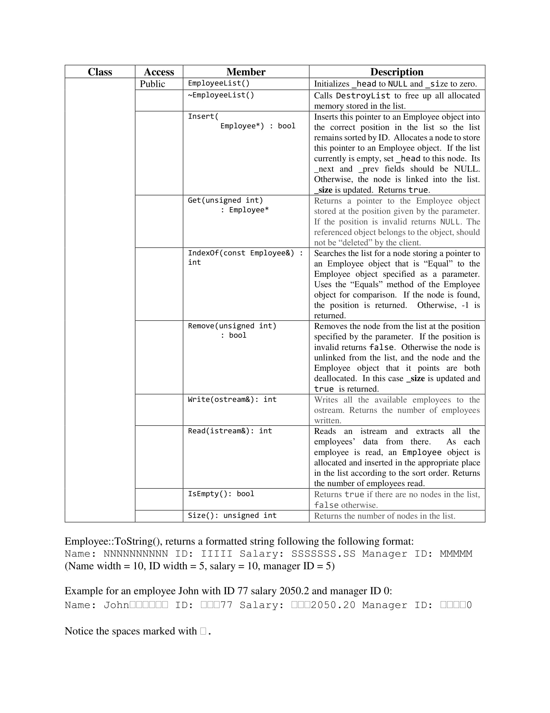

# Company-Employee-Database
Purpose: Create a database of employees and give the user the option to write the database to a file, display all employees, search by name / ID, find boss info, add/remove employees.

## Linked List of Employees

## Classes and Functions

## Main Menu

